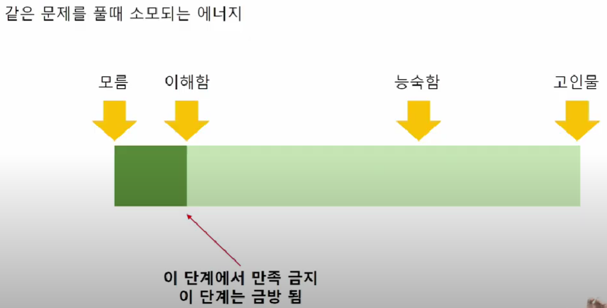

# 알고리즘 기본

-------------------------------------------

1. 재귀호출 기본(백트랙킹)
2. DFS, BFS (그래프탐색)
3. 이진탐색 (Parametric 포함)
4. Heap(P,Q)
5. Dijkstra (P,Q  만든것)
6. 플로이드 (암기)
7. 그리디
8. Union-Find+MST
9. Sliding Window
10. Hash
11. 플리드필

이거 먼저하기

----------------------------------------------------------------------------

부분합,

Trie

DP - 공부시간대비 안좋음

Segment Tree

## 알고리즘을 잘하는 방법은 무엇인가?

## 중수이상일때

- 중수기준 : 삼성 코테 한 문제 풀정도의 실력 (A형)

1. 기출유형을 분석하며 반복적으로 풀어본다
   - 기본기가 어느정도 되었을때 하는게 좋다. 아니면 시간이 많이 듦, 본인을 좋게평하고 있는 것임
2. 알고리즘을 하나씩 마스터해간다
3. 고수들의 코드를 리뷰해보며, 내 것으로 만든다
4. ~~종만북을 정독한다.~~ 
   - 이건 대회용임 95%합격에서 99%합격으로 갈사람만

## 잘하기 위한 준비

1. 능숙함을 목표로
   - 능숙함의 차이
   - 고난이도 문제 : 여러개의 알고리즘이 섞여있는 응용 문제
2. 마인드 컨트롤
3. 문제풀기 전 항상 설계
4. 디버깅은 Trace

### 정올

- 초보자

- 하이면 모두 다 풀어보기

- 능숙도를 올리는 것임

  

- 중수(비기너)

- 쉬운문제 많이 풀어보면 
  - 능숙도 ++
  - 디버깅능력 ++

## 목표로 해야하는 수준

## 쉬운문제 VS 어려운문제

- 중수 이상 되지 않을 때는 
- 쉬운문제를 더 우선적으로 많이 풀어야 한다.
- 기출은 시험 다가올때 풀자

## 추천 공부 방법 Daily 과제

- 매일 쉬운 문제 두 문제씩
- 난이도가 쉽던, 어렵던 매일 두 문제씩 풀자
  - 보통 컨디션 : 매일 두 문제
  - 좋은 컨디션 : 많이 풀자

## 마인드 컨트롤

- 수능시험 세레모니
  - 너무 쉬운거 아니야? 2개 틀리면 2등급이야
- 20년전 알고리즘 공부할 당시
  - 아쉽다
  - 너 못풀었어?
  - 이번 대회 너무 쉽던데?
  - 아무나 다 붙겠어
- 알고리즘 준비는 멘탈관리가 중요하다
- 주변 사람들 / 채팅창이 아니라
- 내가 생각하는 내 실력에 집중하자
- 실력이 만들어지면 결과가 잘 나오며, 실력이 아직 안만들어졌다면, 결과가 잘 나오지 않는다.
- 내가 어느위치인지 알아야한다. 옆사람과의 비교는 필요없다.

## 프로그래밍 언어, 무엇이 좋을까요?

- 20년전,
- 자바가 좋아요 씨쁠쁠이 좋아요?
  - 포트란 추천합니다.
  - 씨쁠쁠은 구식입니다. 자바로하세요
- 현재,
- 파이썬이 좋아요 씨쁠쁠이 좋아요?
  - 자바스크립트 추천합니다.
  - 씨쁠쁠은 전문가용 입니다. 코테는 파이썬이면 충분합니다.

## 코딩실력만 좋으면 무엇이던 괜찮아요. 코딩실력이 낮으면, 무엇이던 안좋아요.

## 문제 풀다 막히면 어떻게 할까요?

- 문제를 풀면 느낌이 옵니다.
- 건들지 못하겠다
- 무엇을 요구하는지도 모르겠다
- 왠지 풀이를 보면 알 것같은데
- -> 풀이를 보지 말고, 더 쉬운 문제를 푸세요.

## P.S 가 현업에 도움이 되나요?

- 조~금 됩니다.
- 디버깅은 확실히 빠릅니다.
- 그 외는, 현업 지식이 더 도움이 됩니다.

## 코테 왜보나요 그럼

1. 코딩 기본기/ 문제해결력
   - 현업자 입장에서는,
   - 신입이 프로그래밍을 떠듬떠듬하면 정말 답답합니다.
   - 반면, 시원시원하면 가르칠 맛이 납니다.
2. 타 스펙 대비
   - IQ검사 (인적성검사) 보다는 더 유용.
   - 확실한 것은 토익 성적보다는 더 유용.
   - 해커톤과 공모전 입상보다는 더 유용.

3. 버스잘타는 사람 방지

## 알고리즘 스터디

- 스터디 성공하려면 사람운이 좋아야합니다.
- 따라서, 혼자 하시는 것을 추천합니다.
- 오픈채팅방은 비추

## 종만북

- 코딩테스트 합격하시고 입사 후에 보시면 됩니다.

## Q&A

- 능숙해지는 과정에서 암기가 자연스럽게 될 수 밖에 없음
  - 일부러 암기하지는 말아라
- IDE 못쓰게 하는 곳이 프로그래머스

# 특강 3화 설계

## 설계 실습 순서

1. 설계에 대해서
2. 주의사항
3. 빅오표기법
4. 절차적 설계
5. 세부 설계
6. 재귀 설계
7. DFS 설계
8. BFS 설계

### 종이에다가

- 준비물적기
  - 재료 적어보기
  - 배열, 자료등등
- 계획
  - key 받고
  - 이중포문으로 푼다
  - todo 리스트처럼

- A4 와 펜으로 해야한다. 반드시!!!
  - 예전부터 내려오는 정석과도 같은 것

- 설계간지
  - 문제풀기전에 종이에다 다 구현해본후 키보드 탁!
- 2시간중
  - 1시간 설계
  - 1시간 구현

## 디버깅 실습 순서

1. 디버깅 기초
2. Trace 연습
3. 디버깅 훈련
4. 디버깅 노하우
