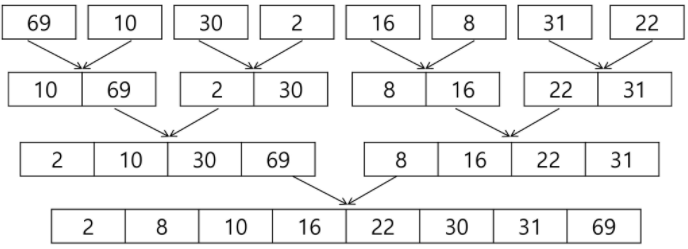

# 분할정복 / 백트랙킹

## 목표

1. 분할정복에 대표적인 알고리즘인 퀵 정렬과 병합 정렬활용
2. 상태 공간 트리의 모든 노드를 검색하는 백트랙킹 연습
3. 이진트리 특성 이해, 탐색, 삽입, 삭제 알고리즘 학습

## 전략

1. 분할 : 해결할 문제를 여러 개의 작은 부분으로 나눔
2. 정복 : 나눈 작은 문제를 각각 해결
3. 통합 : 해결된 해답을 모은다.

### 거듭제곱

- 반복 알고리즘  : O(n)
  - C^2 = C * C
  - C^3 = C * C * C
  - C^n = C * C * C .... * C

```python
iterative(x,n)
	result = 1
	For i in 1 to n
		result = result * x
     Retrun result
```

- 분할 정복 기반의 알고리즘 : O(n log n)
  - C^8 = C * C * C * C .... * C
  - C^8 = C^4 * C^4 = ((C^2)^2)^2
  - C^n = C^(n-1/2) * C^(n-1/2) * C =( C^(n-1/2))^2 * C
  - C^n =
    - C^n/2 * C^ n/2 n은 짝수
    - C^(n-1)/2 * C^(n-1)/2 * C n은 홀수

```python
Recusive(x,n)
	if n==1 :
		return x
    if n is even:
    	y = Recusive(x, n/2)
        return y * y
    else:
        y = Recusive(x, (n-1)/2 )
        return y * y * x
```


## 병합정렬

- 여러 개의 정렬된 자료의 집합을 병합하여 한 개의 정렬된 집합으로 만드는 방식
- 분할정복 알고리즘 활용
  - top down 방식
  - 자료를 최소 단위의 문제까지 나눈 후에 차례대로 정렬하여 최종 결과를 얻어냄.
- 시간복잡도
  - O(n log n)

- 병합정렬 과정

  - {69,10,30,2,16,8,31,22} 를 병합 정렬하는 과정

  - 분할단계 : 최소 크기의 부분집합이 될 때 까지 분할 작업을 계속 시행

    

  

  - 병합단계 : 2개의 부분집합을 정렬하면서 하나의 집합으로 병합

    - 8개의 부분집합이 1개로 병합될 때 까지 반복

      

  

  - 알고리즘 : 분할과정

```python
def merge_sort(lst=[]):
    if len(lst) == 1:
        return lst

    middle = len(lst) // 2

    left = lst[:middle]
    right = lst[middle:]

    left = merge_sort(left)
    right = merge_sort(right)

    return merge(left, right)
```


  - 알고리즘 : 병합과정

```python
def merge(left, right):
    result = []
    while left or right:
        if left and right:
            if left[0] <= right[0]:
                result.append(left.pop(0))
            else:
                result.append(right.pop(0))
        elif left:
            result.extend(left)
        elif right:
            result.extend(right)

    return result
```


## 퀵 정렬

- 주어진 배열을 두 개로 분할, 각각을 정렬
- 병합 정렬과 다른점
  - 병합 정렬은 그냥 두 부분을 나누는 반면에, 퀵 정렬은 분할할 때, 기준 아이템 중심으로, 이보다 작은 것은 왼편, 큰 것은 오른편에 위치시킨다.
  - 각 부분의 정렬이 끝난 후, 병합정렬은 병합이란 후처리 작업이 필요하나 퀵 정렬은 필요치 않는다.

```python
def quick_sort(lst, l, r):

    if l < r:
        pivot = partition(lst, l, r)
        quick_sort(lst, l, pivot-1)
        quick_sort(lst, pivot+1, r)
```

- Hoare-Partition 알고리즘

```python
def hoare_partition(lst, l, r):
    pivot = lst[l]
    i = l
    j = r
    while i <= j:
        
        while i <= j and lst[i] <= pivot:
        # while not (lst[i] > pivot):
            i += 1
        while i <= j and lst[j] >= pivot:
            j -= 1
        if i < j :
            lst[i], lst[j] = lst[j], lst[i]
    pivot, lst[j] = lst[j], pivot

    return j
```

- 아이디어
  - 피봇값 p 보다 큰 값은 오른쪽, 작은 값은 왼쪽에 집합하도록 한다.
  - 피봇을 두 집합 가운데 위치시킨다.


- Lobuto partition 알고리즘

```python
def lomuto_partition(lst,l,r):
    pivot = lst[r]
    i = l-1
    for j in range(l, r):
        if lst[j] <= pivot:
            i += 1
            lst[j], lst[i] = lst[i], lst[j]
    lst[r], lst[i+1] = lst[i+1], lst[r]
    return i+1
```

